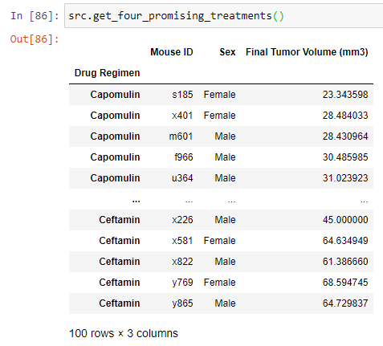

# Matplotlib Challenge

- Can run exercises in `Pymaceuticals/matplotlib-challenge.ipynb`
- Code for exercises is in `exercises.py`
- Code for selecting different data frames is abstracted to `src.py`

## Exercises

1. Checking the number of mice", 
   `Number of mice => 249`

2. Generate a  summary table

   

3. Generate a plot that shows the total mice for each treatment regimen using: 

   - a.) `Panda's dataframe .plot() `

    

   - b.) `Matplotlib's pyplot`

     

4. Generate a pie plot that shows the distribution of female or male mice in the study using:

   - Panda's dataframe .plot()

     

   - Matplotlib's pyplot

     

5.  Calculate the final tumor volume of each mouse across four of the most promising treatment regimens: Capomulin, Ramicane, Infubinol, and Ceftamin

   

6. Outliers

   - a.) Calculate the quartiles and IQR and quantitatively determine if there are any potential outliers across all four treatment regimens

      

   - Using Matplotlib, generate a box and whisker plot of the final tumor volume for all four treatment regimens and highlight any potential outliers in the plot by changing their color and style.

   

7.   Select a mouse that was treated with Capomulin and generate a line plot of time point versus tumor volume for that mouse.

   

8.  Generate a scatter plot of mouse weight versus average tumor volume for the Capomulin treatment regimen.

   

9.  Calculate the correlation coefficient and linear regression model between mouse weight and average tumor volume for the Capomulin treatment. Plot the linear regression model on top of the previous scatter plot.

   

10. Look across all previously generated figures and tables and write at least three observations or inferences that can be made from the data. Include these observations at the top of notebook.

    1. Observation 1: Rat tumor size correlates with mouse weight, and it's statistically significant

       

    2. Observation 2: Capomulin and Ramicane were the only treatments that on average decreased tumor size.

       

       

    3. Observation 3: Mouse 'c326' was an outlier in the Infubinol group when doing the box and whisker plots.  It looks like the last timepoint was 5.. Did the mouse die?

       

    

    

    